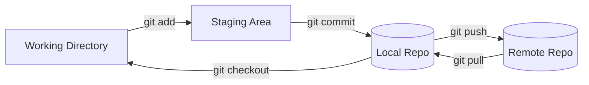

#### Git WorkFlow (Pictoral Representation)

**Git workflows** define a structured way for developers to collaborate on projects using Git and GitHub. They outline how code changes move from a developer’s local machine to the shared repository, ensuring consistency, collaboration, and conflict-free development. 

A typical workflow starts in the working directory, where changes are made to files. These changes are then staged using git add and committed to the local repository with git commit. Once ready, the commits are pushed (git push) to the remote repository on GitHub, making them available to the team. Other contributors can stay up-to-date by pulling (git pull) the latest changes. 

More advanced workflows involve branching strategies, such as feature branches, pull requests, and code reviews, which help maintain code quality and manage multiple contributions in parallel. 

By following an organized Git workflow, teams ensure smooth collaboration, traceability of changes, and efficient project management.
