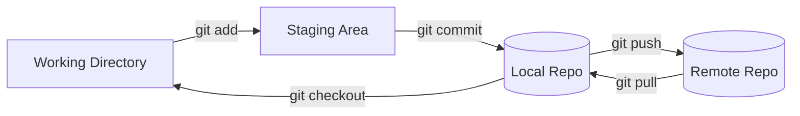

### Git Workflow (Pictoral Representation)

```mermaid
flowchart LR
    WD[Working Directory] -->|git add| SA[Staging Area]
    SA -->|git commit| LR[(Local Repo)]
    LR -->|git push| RR[(Remote Repo)]
    RR -->|git pull| LR
    LR -->|git checkout| WD 
```
