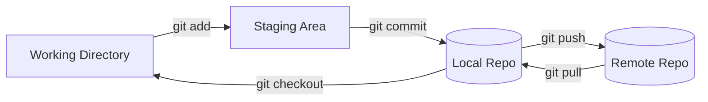

### Git Workflow (Pictoral Representation)

### Git Workflow (In Detail)

               Local Machine (Your PC)                      Remote (GitHub)
 |<-------------────────────────────────------------>|    |<--──────────-->|
 
 Working Directory    Staging Area    Local Repository    Remote Repository
       (files)           (index)           (git repo)           (GitHub)
       ───────           ───────           ─────────           ───────────
          |                  |                   |                   |
          |--- git add ----->|                   |                   |
          |                  |--- git commit --->|                   |
          |                  |                   |--- git push ----->|
          |                  |                   |<--- git pull -----|
          |<--- git checkout-|                   |                   |

Basic Git Commands

Setup identity

git config --global user.name "Your Name"

git config --global user.email "you@example.com"

Initialize repo

git init

Clone repo
git clone https://github.com/username/repository.git

Workflow
git status
git add file.txt
git commit -m "message"
git push origin main
git pull origin main

🌿 Branching & Merging
Create & Switch Branch
git branch new-feature      # create branch
git checkout new-feature    # switch branch
or modern shortcut:
git switch -c new-feature

Merge Branch
git checkout main
git merge new-feature

Delete Branch
git branch -d new-feature       # safe delete
git branch -D new-feature       # force delete

Rebasing
Rebase feature branch onto main
git checkout new-feature
git rebase main

If conflicts occur:
git add conflicted_file.txt
git rebase --continue

Abort rebase if too messy
git rebase --abort

Remote Repositories
git remote -v                 # list remotes
git remote add origin URL     # add remote
git push -u origin main       # push first time

Undoing Things
git checkout -- file.txt            # discard changes
git reset HEAD file.txt             # unstage a file
git reset --hard HEAD~1             # undo last commit
git revert <commit-hash>            # safely revert commit

Useful Shortcuts
git log --oneline --graph --all     # nice branch view
git diff                            # see changes
git stash                           # save work temporarily
git stash pop                       # bring it back

✅ This Git Cheatsheet gives you:

Visual + ASCII workflow

Basic commands

Branching, merging, rebasing

Undo & troubleshooting tools
